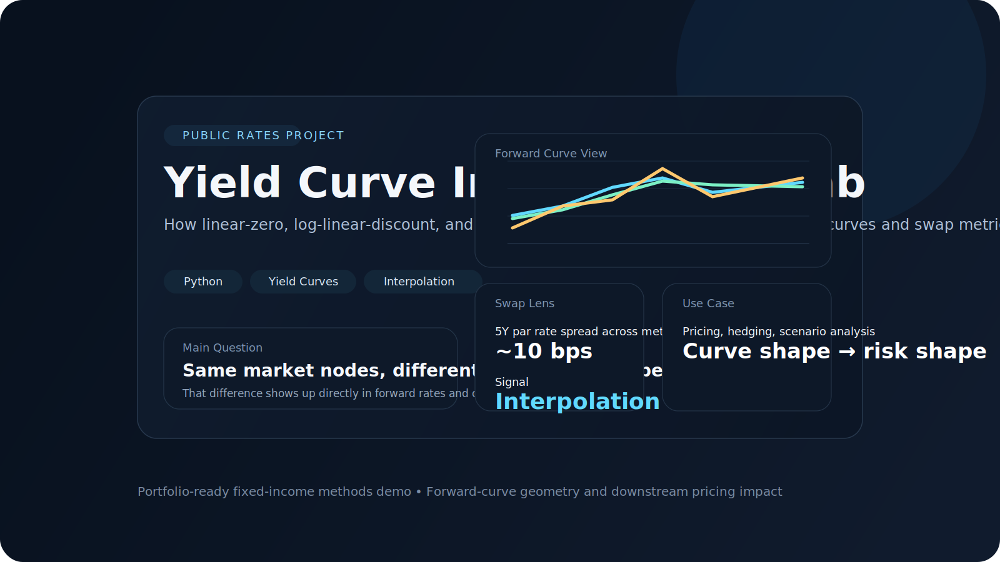
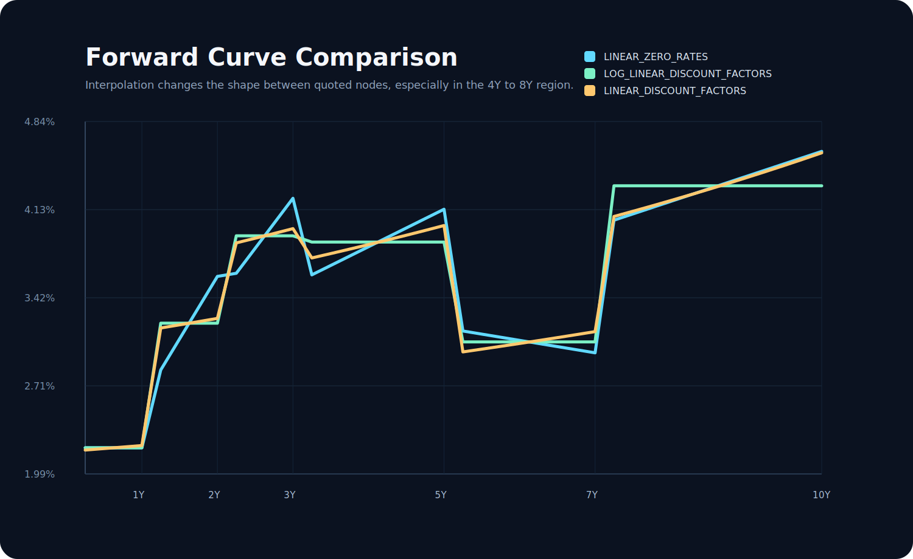
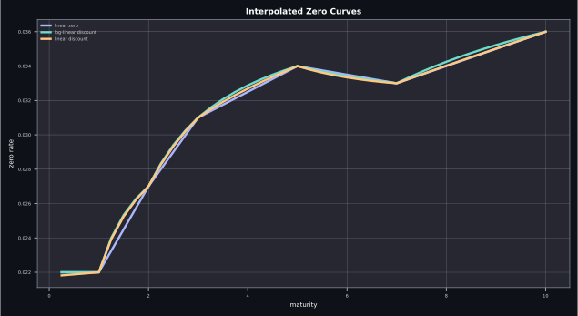
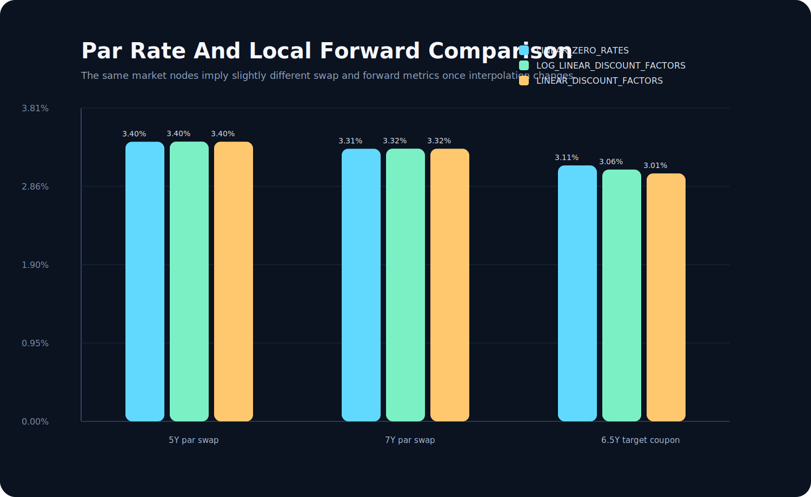
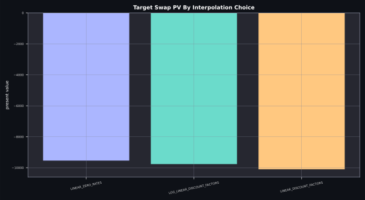

<div align="center">
  <h1>Yield Curve Interpolation Lab</h1>
  <p><strong>A public-facing fixed-income methods project showing how different interpolation choices reshape discount curves, forward curves, and swap metrics from the same market inputs.</strong></p>
  <p>Built as a compact portfolio project focused on analytics, visualization, and downstream pricing impact.</p>
</div>

<p align="center">
  <code>python</code>
  <code>yield curve</code>
  <code>interpolation</code>
  <code>forward rates</code>
  <code>swap analytics</code>
  <code>fixed income</code>
</p>



## At A Glance

| Surface | Purpose |
| --- | --- |
| Curve engine | Builds discount factors from market zero-rate nodes |
| Interpolation study | Compares linear-zero, log-linear-discount, and linear-discount methods |
| Forward-rate view | Shows where the curve shape diverges between nodes |
| Swap lens | Measures how interpolation changes par rates and swap PV metrics |
| Output layer | Exports CSV, JSON, and SVG charts for GitHub-ready documentation |

## Overview

This project isolates a practical fixed-income question that is easy to miss in textbook examples:
if the market quotes only a finite set of curve nodes, what happens between them depends on interpolation.

That choice influences:

- discount factors
- implied forward rates
- par swap rates
- downstream pricing intuition

The repo keeps the setup simple on purpose so the interpolation effect stays visible rather than being buried in framework code.

## Core Formulas

The shared object across all interpolation choices is the discount curve:

```math
P(0,T) = e^{-z(T)T}.
```

From that, the forward rate over a period $[T_1,T_2]$ is

```math
F(T_1,T_2) = \frac{1}{T_2-T_1}\left(\frac{P(0,T_1)}{P(0,T_2)} - 1\right).
```

The three interpolation choices compared in the repo are:

```math
\text{Linear zero: } z(T) = \operatorname{lerp}(z_i, z_{i+1}),
```

```math
\text{Log-linear discount: } \log P(0,T) = \operatorname{lerp}(\log P_i, \log P_{i+1}),
```

```math
\text{Linear discount: } P(0,T) = \operatorname{lerp}(P_i, P_{i+1}).
```

Those choices feed directly into downstream swap metrics, including the par rate

```math
K^\star
=
\frac{\sum_{i=1}^n \left(P(0,T_{i-1})-P(0,T_i)\right)}
{\sum_{i=1}^n \delta_i P(0,T_i)}.
```

## What It Shows

- three deterministic interpolation schemes on the same zero-rate input
- forward-rate comparisons on a quarterly grid
- par-rate comparison for standard swap maturities
- a target swap PV check under each interpolation choice
- exportable outputs for README screenshots and portfolio discussion

## Quick Start

```bash
python3 -m pip install -e .
python3 -m yield_curve_interpolation_lab
PYTHONPATH=src python3 -m unittest discover -s tests -v
```

## Generated Outputs

- `results/curve_grid.csv`
- `results/pricing_summary.csv`
- `results/pricing_summary.json`
- `results/forward_curve_comparison.svg`
- `results/par_rate_comparison.svg`
- `results/zero_curve_comparison.svg`
- `results/target_swap_pv_comparison.svg`

## Preview

<p align="center">
  
  
</p>
<p align="center">
  
  
</p>

## Why This Project Is Useful

- It bridges cleanly into swap pricing and rates analytics work.
- It shows that you understand not only products, but also the numerical choices underneath the curve.
- It is small enough to explain quickly, but concrete enough to feel like a real analytics decision.

## Project Structure

```text
yield-curve-interpolation-lab/
├── pyproject.toml
├── README.md
├── assets/
│   └── cover.svg
├── results/
├── src/yield_curve_interpolation_lab/
│   ├── __init__.py
│   ├── __main__.py
│   ├── charts.py
│   ├── curve.py
│   ├── experiments.py
│   └── swap.py
└── tests/
    └── test_interpolation.py
```

## Notes

- The project focuses on interpolation mechanics rather than production curve bootstrapping.
- The point is not that one interpolation is always best, but that the choice is economically meaningful.
